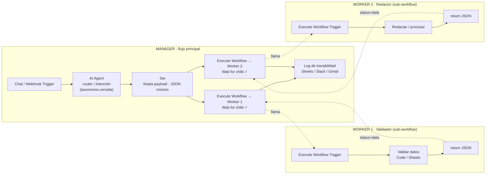

# Módulo 2 — Arquitectura Multi-Agente (Pre-entrega 2)

Segundo hito del **proyecto integrador** del curso *AI Automation Avanzado*.
Se parte del agente del Módulo 1 (`AgendaBot`) y se lo transforma en una **red modular
Manager-Worker** con sub-workflows en n8n. **No se rehace desde cero: se extiende.**

> Checkpoint: **Orquestación Multi-Agente Distribuida**
> Entrega: **13 oct 2026 · 21:00 hs** — se corrige **solo el PDF**.

- 📄 [`resumen-clase.md`](./resumen-clase.md) — resumen completo de la clase (2 h 23) y los conceptos del módulo.
- 🌐 Guía visual (HTML) con los esquemas redibujados: en el Drive del curso → `Avanzado/Entregas/02`.

---

## Qué requiere la Pre-entrega 2

### 1. Componentes obligatorios de la arquitectura

| # | Componente | Requisito |
|---|------------|-----------|
| 1 | **Workflow Manager** (orquestador) | Flujo central con un trigger. Implementa un **AI Agent** o clasificador semántico que interpreta la intención dentro de una **taxonomía cerrada** de negocio y decide a qué especialista delegar. |
| 2 | **Workers como sub-workflows** | **Al menos DOS** flujos independientes, en **lienzos separados**. Cada uno inicia obligatoriamente con el nodo **`Execute Workflow Trigger`** y resuelve una **única tarea atómica** (ej.: extracción/validación de datos y redacción de correos). |
| 3 | **Handoff de datos** (contrato de interfaz) | En el Manager, el nodo **`Execute Workflow`** debe pasar **JSON limpio** al hijo y tener activada **`Wait for child to finish`** (pausa al Manager hasta recibir el resultado estructurado). |
| 4 | **Persistencia / Log de trazabilidad** | Nodo final de reporte (**Slack, Google Sheets o Gmail**) conectado al flujo principal, que registre **qué Worker se invocó, qué parámetros se enviaron y qué respuesta devolvió**. |

### 2. Esquema de referencia



> Ejemplo real armado en la clase (Manager):
> `INICIO → Obtener datos del sheet → Pasarlo a JSON → Call "Worker1_ValidadorDatos"` (nodo Execute Workflow).

### 3. Contrato de datos (JSON)

```jsonc
// Manager → Worker: mínimo producto viable
{ "customer_id": "C-1043", "intent": "TECH_SUPPORT", "original_input": "no puedo entrar" }

// Worker → Manager: respuesta estandarizada
{ "status": "success", "data": { "summary": "cliente insatisfecho por el retraso", "priority": "high" } }

// Ante fallo: contingencia (no morir en silencio)
{ "status": "error", "reason": "no se pudo leer el balance" }
```

### 4. Configuración del handoff

| Dónde | Qué configurar |
|-------|----------------|
| **Manager · Execute Workflow** | Seleccionar el sub-workflow · activar **Wait for child to finish** · pasar solo los campos JSON necesarios · fijar **timeout** por latencia de APIs. |
| **Manager · Set (antes de delegar)** | Recortar el payload: nada de binarios ni metadatos pesados. Solo el mínimo producto viable. |
| **Worker · Execute Workflow Trigger** | *Input data mode: Define using fields below* → definir el **Workflow Input Schema** (campos que espera recibir). |
| **Worker · nodo final** | Un **Set** que arme el JSON de salida (`status` + `data`). Ante error, devolver `status: "error"` en vez de caer. |

### 5. Errores que desaprueban (evitar)

- **Workflow "mono-bloque":** meter toda la lógica en el flujo principal. Sin sub-workflows independientes → **desaprobado automáticamente**.
- **"Pasillo de la muerte" (data stuffing):** pasar objetos gigantes a un Worker que solo necesita un ID/texto → poner un `Set` antes.
- **Ignorar el time-out:** no prever latencia de APIs externas.
- **Sin manejo de fallos:** el Worker debe devolver un JSON de contingencia (`status: "error"`), no morir y bloquear al Manager.

### 6. Formato de entrega

- **Archivo único:** `preentrega_modulo2_apellido_nombre.pdf` — subido a la sección de entregas de la plataforma. **Es lo único que se corrige.**
- **Opcional (no resta):** `manager_modulo2_apellido_nombre.json`, `worker1_….json`, `worker2_….json`.

### 7. Checklist del PDF

- [ ] Captura del **lienzo del Manager** completo, con el nodo Execute Workflow visible.
- [ ] Capturas de **los dos Workers**, cada uno con su Execute Workflow Trigger y su nodo de salida.
- [ ] Captura de la **config del Execute Workflow** mostrando el paso de datos y **Wait for child to finish activado**.
- [ ] Captura del **panel de ejecución** con una corrida exitosa de punta a punta.
- [ ] **Explicación escrita** del esquema de datos entre Manager y Worker, y del criterio de enrutamiento.
- [ ] **Testing de regresión previo**: correr manualmente desde el Manager y verificar delega → responde → vuelve integrado.

---

## Notas para hacerlo rápido

- Reusá el agente del M1 como **Router del Manager**, acotando su prompt a una taxonomía cerrada (ej. `CATALOGO`, `SOPORTE`, `VENTAS`).
- Los dos Workers pueden ser simples: uno de **lectura/validación** (Sheets o Data table) y otro de **redacción** (un AI Agent chico).
- Probá **cada Worker aislado antes** de enlazarlos, así el error no aparece recién en el Manager (en la clase el "Call Worker" falló por leer un dato inexistente).
