# Módulo 3 — Memoria y Persistencia (Pre-entrega 3)

Tercer hito del **proyecto integrador** del curso *AI Automation Avanzado*.
Se parte del **workflow del Módulo 2** (arquitectura multi-agente de la agenda de la clínica)
y se le **suma la capa de memoria de largo plazo** (persistencia externa en Airtable,
lectura/escritura por `Session_ID` y *summarization* automática). **No se descarta nada del M2: se extiende.**

> Checkpoint: **Capa de Persistencia Correlacionada y Memoria Híbrida**
> Entrega: **PDF** `PreEntrega_Modulo3_NombreApellido.pdf` (3 páginas).

- 📄 [`resumen-clase.md`](./resumen-clase.md) — resumen de la clase (2 h 28) y las 4 unidades del módulo.
- 🌐 Guía visual (HTML): artifact `Módulo 3 · Memoria y Persistencia`.

---

## Qué requiere la Pre-entrega 3

| # | Componente | Requisito |
|---|------------|-----------|
| 1 | **Base relacional de memoria** | Tabla externa con columnas fijas: `Session_ID`, `Fecha de Actualización`, `Resumen Consolidado`, `Estado del Caso`, `Datos Clave`. |
| 2 | **Lectura (Search Records)** | Justo después del trigger, un nodo Airtable que aísle el registro cuyo `Session_ID` coincida (blindaje anti *amnesia cruzada*). |
| 3 | **IF nuevo/recurrente** | Rama falsa (usuario nuevo) → crea el registro inicial sin errores; rama verdadera → inyecta el contexto recuperado. |
| 4 | **Inyección de contexto** | En el System Prompt del AI Agent, con delimitadores rígidos `[INICIO DE CONTEXTO COMPARTIDO] … [FIN DEL CONTEXTO COMPARTIDO]`. |
| 5 | **Summarization > 5 mensajes** | LLM económico que devuelve un JSON `{asunto_principal, puntos_clave[], accion_requerida}`; se persiste con **upsert idempotente**. |
| 6 | **Guardrail** | Prohibido volcar HTML pesado, logs o transcripciones completas: solo resumen analítico e indicadores accionables. |

**Formato del entregable (PDF):** Página 1 → captura del lienzo completo · Página 2 → prompt exacto del modelo mini (JSON) · Página 3 → esquema de la base.

---

## Arquitectura construida (M2 + memoria)

```mermaid
flowchart LR
  T["Chat Trigger<br/>(Session_ID)"] --> B["Buscar memoria<br/>Airtable Search por Session_ID"]
  B --> IFR{"¿Usuario<br/>recurrente?"}
  IFR -- "no" --> CRI["Crear registro inicial<br/>(Airtable create)"]
  IFR -- "sí" --> PC["Preparar contexto"]
  CRI --> PC
  PC --> R["Router (AI Agent)<br/>+ Memoria de sesión<br/>+ [INICIO/FIN CONTEXTO]"]
  R --> AG["AGENDA M2:<br/>Contrato → Switch → Buscar turnos →<br/>Resolver → Crear/Modificar → Workers → Confirmación"]
  AG --> LOG["Log de trazabilidad (Gmail)"]
  LOG --> CD["Consolidar datos<br/>(Paciente | Motivo | Turno)"]
  CD --> IF5{"¿Más de<br/>5 mensajes?"}
  IF5 -- "sí" --> SUM["Resumir (LLM mini) → Parsear JSON"] --> UP["Guardar memoria<br/>(upsert)"]
  IF5 -- "no" --> CNT["Actualizar contador<br/>(upsert)"]
```



**Capas de memoria que conviven:**
- **Corto plazo** (`Memoria de sesión`, Window Buffer): los últimos ~10 mensajes de la charla actual (RAM, por `sessionId`).
- **Largo plazo** (Airtable): un registro por sesión, persistente entre ejecuciones.
- **Estado del flujo**: el contador `Mensajes` y el `intent`, solo durante la ejecución.

Ciclo: **leer** memoria al inicio → **inyectar** en el prompt → resolver el turno (agenda M2) → **consolidar y escribir** al final (resumen si supera 5 mensajes).

---

## Esquema de la base (Airtable · base `Memoria_Agente_M3` · tabla `Memoria`)

| Columna | Tipo | Rol |
|---------|------|-----|
| `Session_ID` | Single line text (primario) | ID único de sesión/usuario. Clave de lectura, filtro y match del upsert. |
| `Fecha de Actualización` | Date/time (ISO, 24h, BA) | Marca temporal de la última escritura. |
| `Resumen Consolidado` | Long text | Resumen analítico (LLM) al superar 5 mensajes. Nunca la transcripción cruda. |
| `Estado del Caso` | Single select (`En Progreso`/`Pendiente`/`En Revisión`/`Cerrado`) | Fase viva del proceso. |
| `Datos Clave` | Long text | Datos duros: `Paciente: … \| Motivo: … \| Turno: DD/MM/AAAA HH:MM`. |
| `Mensajes` | Number (entero) | Contador auxiliar; dispara la summarization al superar 5. |

---

## Prompts

**Inyección de memoria (System Prompt del Router):**
```
### MEMORIA DE LARGO PLAZO (contexto recuperado de Airtable) ###
[INICIO DE CONTEXTO COMPARTIDO]
Estado del caso: {{ $json.estado }}
Resumen de la ultima charla: {{ $json.last_summary }}
Datos clave del usuario: {{ $json.datos_clave }}
[FIN DEL CONTEXTO COMPARTIDO]
Usa ese contexto como memoria previa del usuario; si viene vacio, trata al usuario como nuevo y no inventes datos.
```

**Summarization (System del modelo mini, fuerza JSON):**
```
Sos el consolidador de memoria de una agenda de clinica. Resumi el intercambio teniendo en
cuenta paciente, motivo y turno si aparecen. Devolve EXCLUSIVAMENTE un JSON valido, sin texto
adicional ni bloques de codigo, con esta forma exacta:
{"asunto_principal":"","puntos_clave":[],"accion_requerida":""}.
asunto_principal = una frase de que paso en la conversacion. No incluyas HTML, logs ni la
transcripcion. Espanol rioplatense.
```

---

## Errores a evitar (del material)

- **Amnesia cruzada:** leer sin filtrar por `Session_ID` → un usuario ve datos de otro. Filtro obligatorio.
- **Guardar la transcripción cruda:** llena la base de ruido. Guardar solo el resumen estructurado.
- **No manejar el usuario nuevo:** sin el IF, el flujo falla o muestra variables vacías.
- **"Teléfono descompuesto":** resumir de más pierde matices. Buffer de corto plazo + datos duros en columnas.
- **Sobrescribir mal:** usar *Create* en recurrentes crea duplicados. Para recurrentes: **upsert idempotente**.

---

## Notas de implementación

- La memoria se indexa por **`Session_ID`** (el id de sesión de n8n), tal como pide la consigna. Con el sessionId efímero de n8n, un mismo usuario en **otro chat** no arrastra su sesión anterior; para reconocimiento entre sesiones habría que indexar por un identificador estable del paciente (nombre/DNI) — mejora prevista para producción, fuera del alcance de esta entrega.
- El "modelo mini" quedó con `claude-sonnet-4-6` (credencial Anthropic existente); intercambiable por Haiku o GPT-4o-mini sin cambiar el prompt.
- `Mensajes` es un campo auxiliar para el disparador del ">5"; las 5 columnas de la consigna se mantienen.
- Se parte del `.json` del M2 y se reutilizan sus workers (duplicados para el M3 apuntando a la planilla `Agenda_Turnos` de la carpeta `03`).
