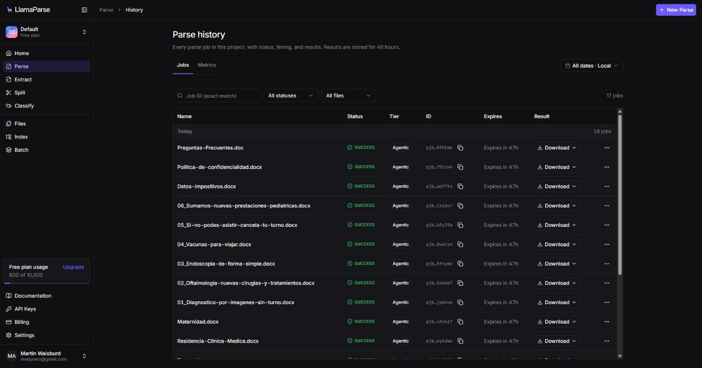
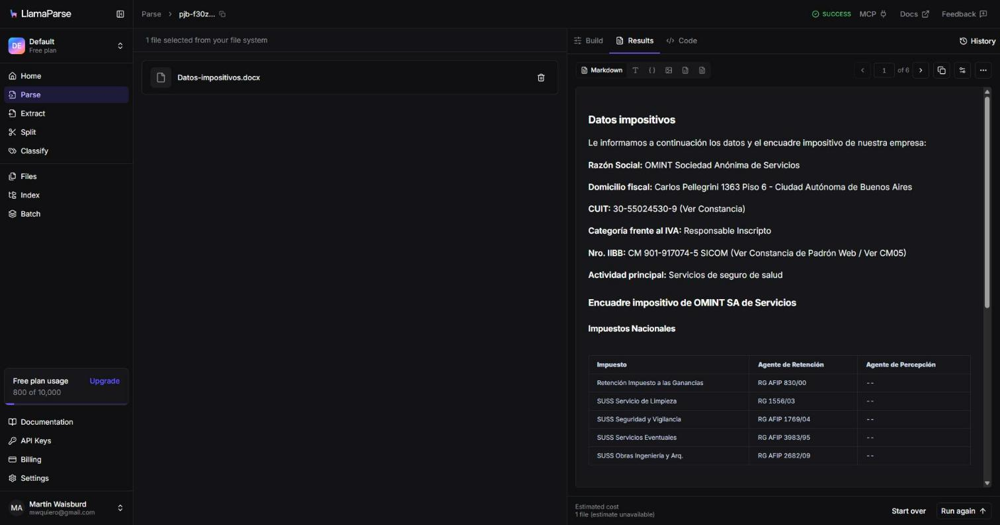

# Pieza 1 — Ingesta documental con LlamaParse (LlamaCloud)

La base de conocimiento son **16 documentos institucionales** de la Clínica LoDeTincho (.docx/.doc). Se parsearon con **LlamaParse (LlamaCloud), tier Agentic**. El markdown resultante **preserva la jerarquía de títulos** (documento › sección › subsección; por ejemplo *Especialidades › Cardiología*) y **las tablas como filas y celdas** (por ejemplo, el encuadre impositivo por provincia). Ese markdown es la fuente que n8n corta **por sección**: cada fragmento lleva adelante su ruta de títulos y se vectoriza en Qdrant, con 195 fragmentos en total.

**Qué se limpió antes y durante la ingesta**
- **Anonimización:** la marca institucional se reemplazó por "LoDeTincho" y los datos de contacto reales por los canales del proyecto (mail y chat del asistente).
- **Tablas:** LlamaParse devuelve las tablas complejas, con celdas combinadas, como HTML. El nodo de *chunking* las convierte a tabla markdown, una fila por línea, y las tablas largas se parten por filas repitiendo el encabezado.
- **Control de fidelidad:** en 5 de 16 documentos el parser alteró texto: "Billinghurst" quedó como "Billinghamurst" y "lodetincho" como "lodetinho". Quedó registrado como riesgo, con su control, en el plan de gobernanza (pieza 5).

**Por qué *Parse* y no un *Data Source / Index* de LlamaCloud**
En LlamaCloud, un *Data Source* pertenece a un *Index* gestionado (parseo + chunking + embeddings + vector store alojados por LlamaCloud). **El plan gratuito del proyecto no permite crear Index**, así que se usó el servicio **LlamaParse** del mismo LlamaCloud, que es justamente la etapa que preserva la jerarquía y las tablas, y el resto del pipeline se armó en n8n con un vector store propio (**Qdrant**). Esta decisión, además, da control directo sobre el *chunking* por sección y sobre el umbral de similitud (pieza 2), que en un Index gestionado quedan del lado del proveedor.
