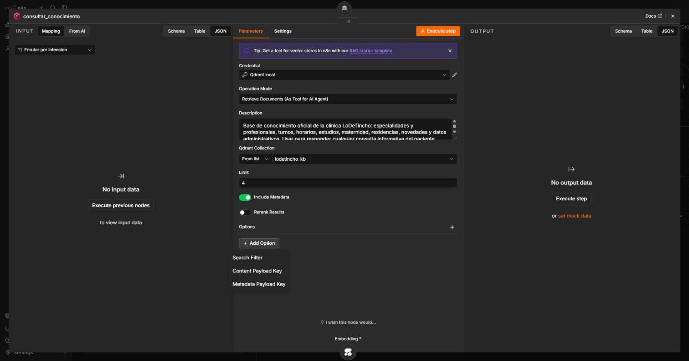
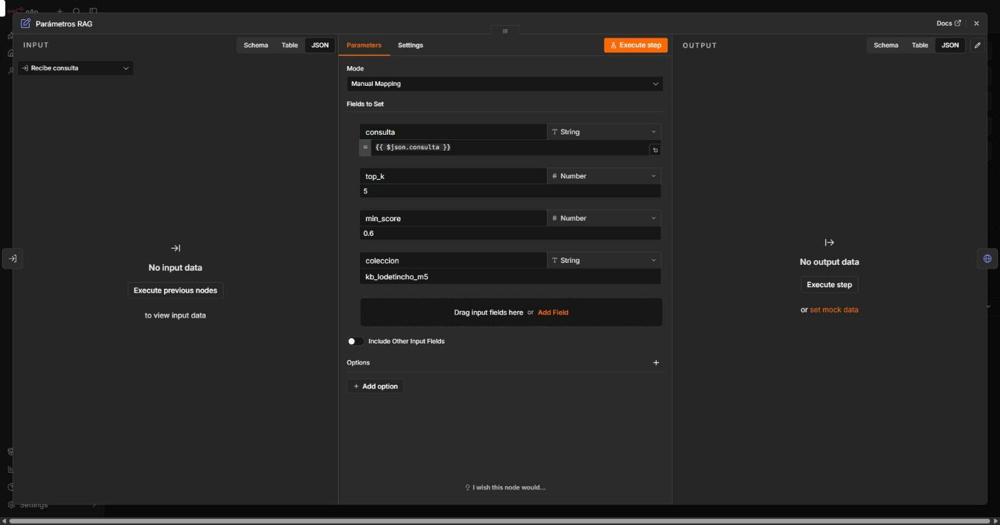
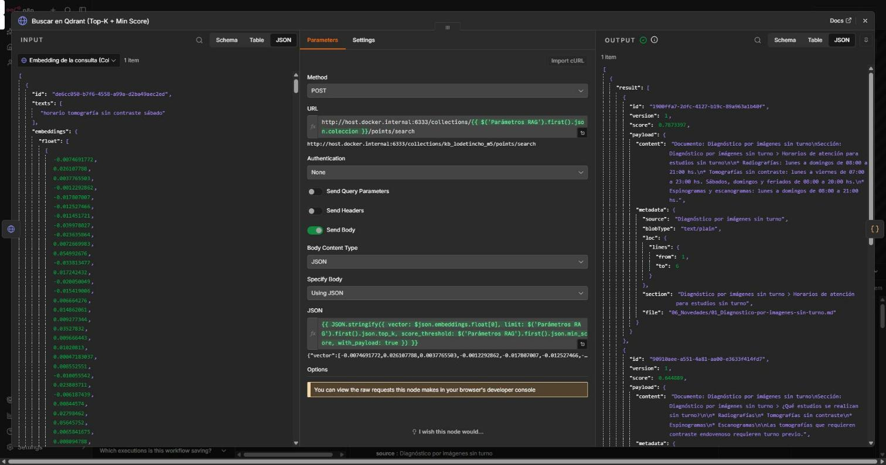

# Pieza 2 — Recuperación: Top-K y Minimum Score

**Configuración:** **Top-K = 5** y **Minimum Score = 0.60** (similitud coseno, embeddings Cohere `embed-multilingual-v3.0`, colección Qdrant `kb_lodetincho_m5`).

## Por qué no se usa el nodo nativo *Vector Store Retrieve Tool*

En la versión de n8n del proyecto (2.39.5), el nodo **Qdrant Vector Store → "Retrieve Documents (As Tool for AI Agent)"** permite fijar el **Top-K** (campo *Limit*), pero **no tiene Minimum Score**: sus únicas opciones son *Search Filter*, *Content Payload Key* y *Metadata Payload Key*. Se verificó también en el código de todos los nodos de vector store de esta versión: ninguno expone un umbral de similitud.

Para aplicar los dos parámetros que pide el criterio, la herramienta `consultar_conocimiento` del agente se implementó como un sub-workflow (`Tool_ConsultarConocimiento (M5)`, conectado con *Call n8n Workflow Tool*). Cumple el mismo rol que el *Vector Store Retrieve Tool*, pero llama a la búsqueda de Qdrant con `limit` (Top-K) y `score_threshold` (Minimum Score), los dos visibles en un único nodo de parámetros:

`consulta → Parámetros RAG (top_k, min_score) → Embedding Cohere (search_query) → Qdrant /points/search (limit + score_threshold) → fragmentos con fuente, sección y score`

## Por qué esos valores: calibración con datos

Antes de fijar el umbral, se corrió la herramienta **sin umbral** (Top-K = 8) con preguntas que tienen respuesta en la base y con preguntas que no la tienen:

| Consulta | ¿Está en la base? | Score del mejor fragmento | Fragmentos no relacionados |
|---|---|---|---|
| Profesionales de Cardiología | Sí | 0.704 | 0.59 – 0.65 |
| ¿La maternidad tiene UCIN? | Sí | 0.735 | 0.55 – 0.64 |
| Camas de internación | Sí | 0.716 | 0.52 – 0.62 |
| Vacunas para viajar | Sí | 0.692 | 0.42 – 0.46 |
| Precio de una consulta particular | **No** | 0.545 | 0.48 – 0.52 |
| Estacionamiento para pacientes | **No** | 0.541 | 0.49 – 0.53 |

- **Minimum Score = 0.60 (precisión).** En las preguntas con respuesta, el fragmento correcto supera 0.69; en las preguntas fuera de la base, el mejor fragmento no pasa de 0.55. El umbral separa los dos casos: para una pregunta sin respuesta en la base, la herramienta devuelve **0 fragmentos** y el agente responde "No sé" de forma determinista, en lugar de improvisar con fragmentos parecidos. Con un umbral de 0.50, ese ruido (0.54) entraría al contexto.
  Dentro del dominio, algunos fragmentos vecinos también superan 0.60 (por ejemplo, *Cirugía General* con 0.62 al preguntar por Cardiología). Ese filtrado fino no lo hace el umbral sino el agente, con la regla "no presentes lo relacionado como si fuera lo exacto".
- **Top-K = 5 (costo).** Los fragmentos útiles se concentran en las primeras 2 a 4 posiciones (por ejemplo, tomografía: 0.787 / 0.645 / 0.618 / 0.606). Con 5 queda margen para preguntas de dos partes (la de la residencia usó 2 fragmentos) sin inflar el contexto. Como los fragmentos son por sección (mediana de 226 caracteres), 5 fragmentos son unos 300 tokens por búsqueda; la herramienta responde en 0.4 a 1.9 s.
- **El costo del umbral y cómo se mitiga.** Una consulta muy corta, o un dato que vive en una tabla, puede quedar apenas por debajo de 0.60: en la validación, la primera búsqueda de "IIBB Mendoza" devolvió 0 fragmentos. En lugar de bajar el umbral (lo que dejaría entrar ruido), el agente **reformula la búsqueda una vez** con sinónimos o con el nombre del tema, y así recuperó el dato. Es una regla del system prompt (pieza 3).
